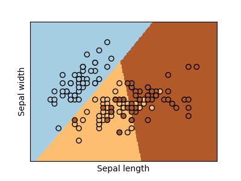

# Docker-FastAPI Deployment

This is an example of how to deploy a maching learning model using Scikit-learn, FastAPI and Docker containers, the model is a logistic-regression classifier on the first two dimensions (sepal length and width) of the iris dataset.



## Build Docker Image

Run the following command to build your FastAPI image
```
docker build -t iris-app . 
```

## Create and Run Docker container

Run the following command to run a container based on your image

```
docker run -p 3000:80 iris-app
```
